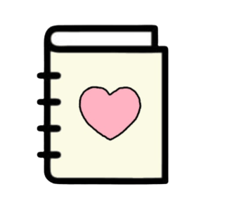

## **PROJECT PROPOSAL**  
By: **Unna Lael Jaldon** and **Alpha Celestine Jimenez** of *9 - Rubidium*

---

### **Subject To Love**
**Why choose between GWA and JOWA when you can have both?**

---

### **1. Logo/Favicon**

---

### **2. Description**
> Welcome to ***Subject To Love***, the ultimate school dating simulator!  
> This match-making visual-novel style game aims to find you the perfect subject that shall be your partner for the rest of the year ;).  
> With a loving and caring subject by your side, you'll be able to flourish in school and have fun with learning!  
> So, what are you waiting for?  
> Start with meeting the different subjects: **Biology, Chemistry, Physics, Math, English, Filipino, Social Science, Computer Science,** and **Statistics**.  
> Interact with them — you'll find out more about them and eventually, you'll learn who you're most compatible with!  
> Is it the ever soft-spoken **English**, who will shower you with compliments, or the daring intellectual **Math**, who's willing to help you every step of the way?  
> Play now, and enjoy your school year love story! >:3

---

### **3. Outline Of Webpages**

#### ***Home Page***
- Introduction to the player  
- Images of subject characters to hook the player  
- Four links:  
  - `About the Game` (About the Game page)  
  - `PLAY!` (Actual Game page)  
  - `Notebook` (Notebook page)  
  - `Gallery` (Gallery page)  
- Background music toggle  

---

#### ***About the Game Page*** `(About the Game)`
- History of the game  
- Game guide (for beginners)  
- Secret tip to get best ending *(Google Doc link)*  

---

#### ***Actual Game Page*** `(PLAY!)`
- Text box for dialogue  
- Background art  
- Character sprites  
- Interactive buttons  

---

#### *(In the `nav` bar)*

##### ***Notebook*** `(Notebook)`
- Character sprites  
- Short bios (likes + dislikes)  
- Their favorite quote  

##### ***Gallery*** `(Gallery)`
- Small trivia  
- Ending art  
- Behind-the-scenes photos  

---

### **4. How JS Will Be Incorporated**

JavaScript will be used primarily on the **“Actual Game”** part of the website, which simulates the visual novel/dating sim experience.  
It will handle interactive elements and dynamic dialogue display, allowing players to click through conversations, make choices, and see corresponding sprite or background changes (without reloading the page).

**JS will:**
- Control the typewriter text effect for character dialogue.  
- Manage choice buttons that change the next line of dialogue and character reactions.  
- Trigger sprite swaps or background transitions based on player decisions.  
- Save simple progress or affection points using `localStorage`, so players can resume or see different endings.  
- Add smooth page transitions, hover animations, and background music control across pages.

---
### **5. Website Wireframe**

[Click here](https://www.canva.com/design/DAG3JuFmKzE/Ik5zgKS65P_vFvCoF-FDXA/edit?utm_content=DAG3JuFmKzE&utm_campaign=designshare&utm_medium=link2&utm_source=sharebutton)
---

# Q3 PROJECT PROPOSAL UPDATE
By: **Unna Lael Jaldon** and **Alpha Celestine Jimenez** of *9 - Rubidium*

## Subject to Love!
---
## ***Features*** 
- Compatible for both mobile and laptop  
- Settings page that adjust text speed and volume
- Different background music for different scenes
- Use of localstorage to make each experience feel different and personalized
- Complete and original sprites, CGs, etc.
- A loading page when you first enter the site with custom animations
- Scroll bars for About the Game and Settings
- Sticky nav bars
- The ability to autoplay the dialouge, check the dialogue history, and saving and loading progress
- Add a testimonials/feedback section under the About the Game text box
- Minigames similar to DDLC's poetry writing
- Color and theme toggle
- More animations
- Locking certain CGs in the gallery until you experience them
- Easter eggs!!
- Footers
  
---

## ***Details*** 
- We will use HTML to 
  
---

## ***Definition of Done***
Our project will be done when we have a fully polished, enjoyable, interesting dating sim that anyone can play. We want to make it fun and heartfelt, while letting the player customize the website to their liking (colors, dialogue, etc.), to take off the burden of reality for just a little while.
